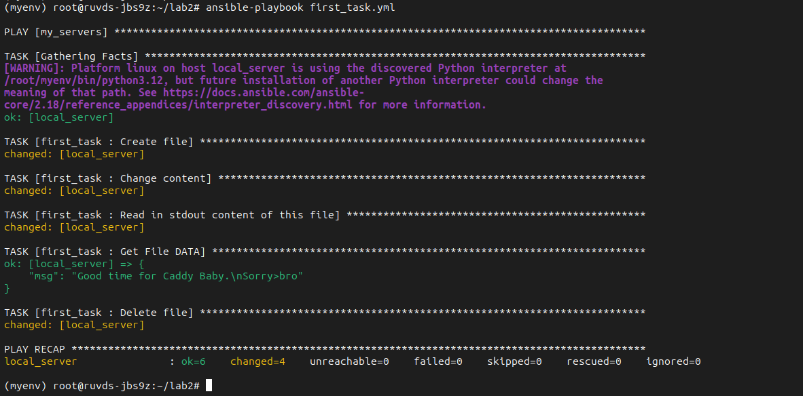
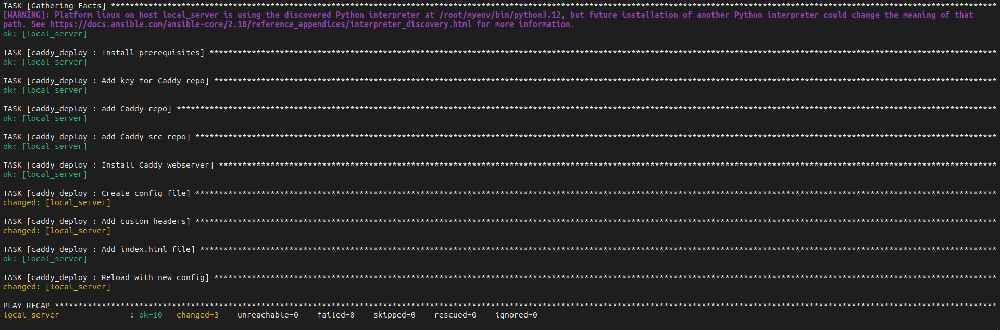
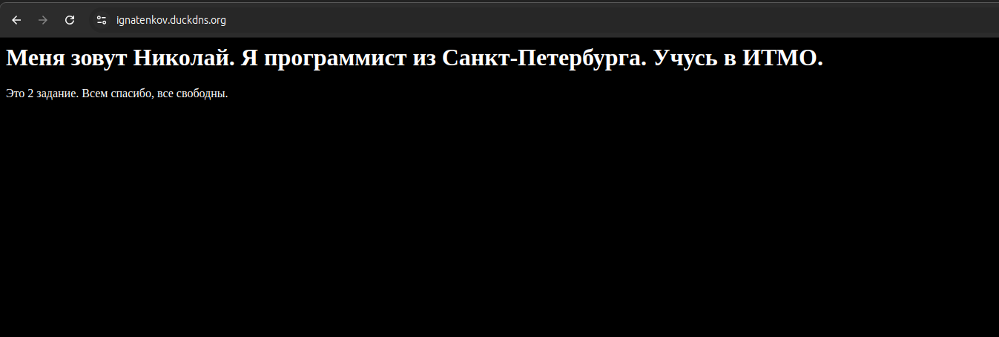

## Лабораторная работа №1
## Задание 1
Переписать пример с созданием и удалением файла из шага 5 Части 1 с ad-hoc команд на плейбук формат, а так же добавить четвертый шаг - перед удалением поменять содержимое файла на любое другое. 

```yaml
---
- name: Create file
  copy:
    dest: "{{ ansible_env.HOME }}/first_task.txt"
    content: |
      Good time for Caddy Baby. 

- name: Change content
  lineinfile:
    path: "{{ ansible_env.HOME }}/first_task.txt"
    line: "Sorry>bro"

- name: Read in stdout content of this file
  shell: cat "{{ ansible_env.HOME }}/first_task.txt"
  register: output_file_content
  tags: read_file

- name: Get File DATA
  debug:
    msg: "{{ output_file_content.stdout }}"
  tags: read_file

- name: Delete file
  file:
    path: "{{ ansible_env.HOME }}/first_task.txt"
    state: absent
  tags: remove_file
```

### Результат выполнения



## Задание 2
“Расширить” конфиг вебсервера Caddy любым функционалом по желанию: например, добавить проксирование, или какие-нибудь заголовки (header). Вместо дефолтной страницы Caddy подставить свою, хотя бы index.html с Hello world внутри. Добавить это в качестве дополнительного шага в tasks.

1. Добавил заголовки.
2. Изменил главную страницу приложения.

```yaml
- name: Add custom headers
  blockinfile:
    path: /etc/caddy/Caddyfile
    block: |
      header {
          X-Content-Type-Options "nosniff"
          X-Frame-Options "DENY"
          X-XSS-Protection "1; mode=block"
      }
    marker: "# {mark} ANSIBLE MANAGED BLOCK - CUSTOM HEADERS"
    insertafter: "^ignatenkov.duckdns.org {"


- name: Add index.html file
  copy:
    dest: /usr/share/caddy/index.html
    content: |
      <html>
      <head>
          <title>Home Page</title>
      </head>
      <body style='background:black;color: #fff'>
          <h1>Меня зовут Николай. Я программист из Санкт-Петербурга. Учусь в ИТМО.</h1>
          <p>Это 2 задание. Всем спасибо, все свободны.</p>
      </body>
      </html>

```
### Результаты выполнения



