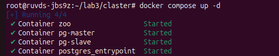
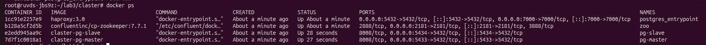
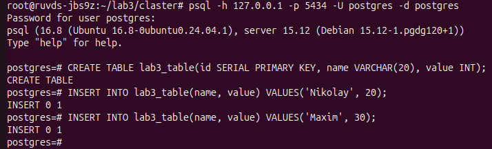
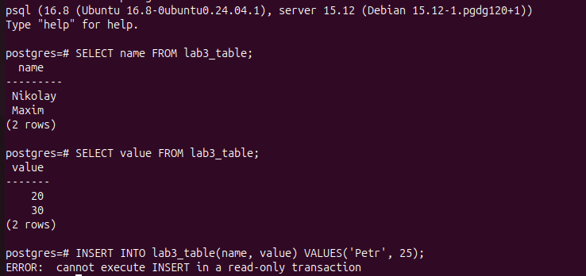
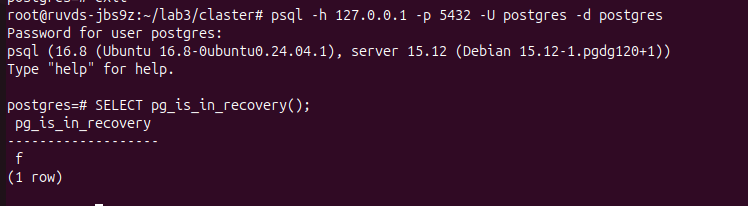
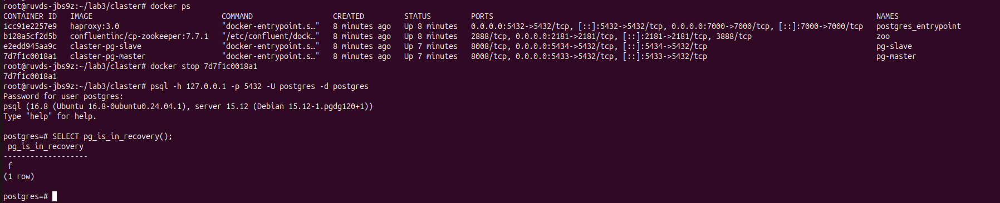

# Лабораторная работа №3
Работа выполнялась на удаленном виртуальном сервере. 
## Часть 1
Поднимаем Postgres и всю инфраструктуру. 4 сервиса. 

## Часть 2
Проверяем репликацию.

## Часть 3
Делаем среднего роста высокую доступность

